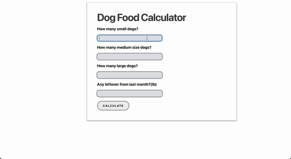
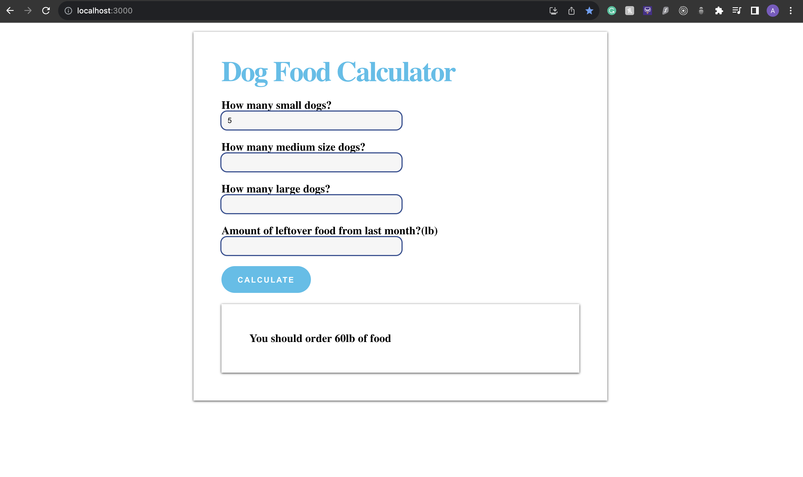
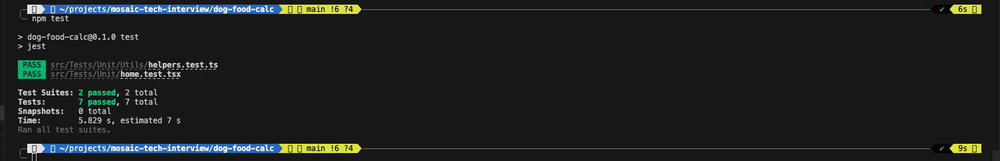

# mosaic-tech-interview


Welcome to the team at Mosaic! Here is an overview of the project.
I hope this can prove a bit of my technical skills. Thank you for making the time to check my work and hopefully consider it sufficient. 

---

### Table of Contents
- [How To Install](#how-to-install)
- [How To Test](#how-to-test)


---
## How To Install

This is a simple react app, so I will leave some of the commands below. But I apologize if it takes a second to get all this, doing it in react had the downside of making it a bit heavier on your side.
```
git clone https://github.com/Adrianbarros/mosaic-tech-interview.git

cd dog-food-calc
npm install 
npm start
```

This will get the App running and on http://localhost:3000/ will be the calculator running.

Here is a peak!
(Again the design was not the main focus, I know its pretty simple)


>UPDATE: I took the liberty to use some of the styles and colors found in the company's website to update the styles just to give it color. 



## How To Test

I am using Jest and testing library to do unit testing for both the funtion and the front-end. But it should be simple to run with:

```
npm test
```
